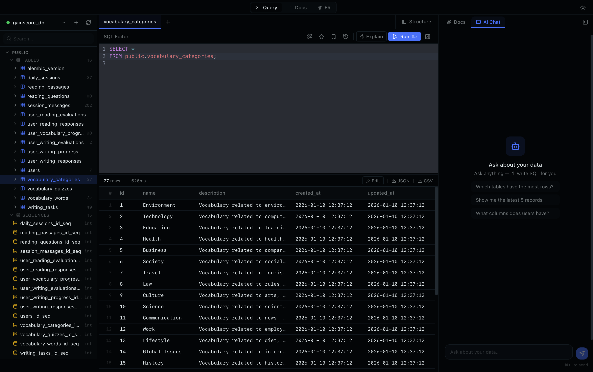
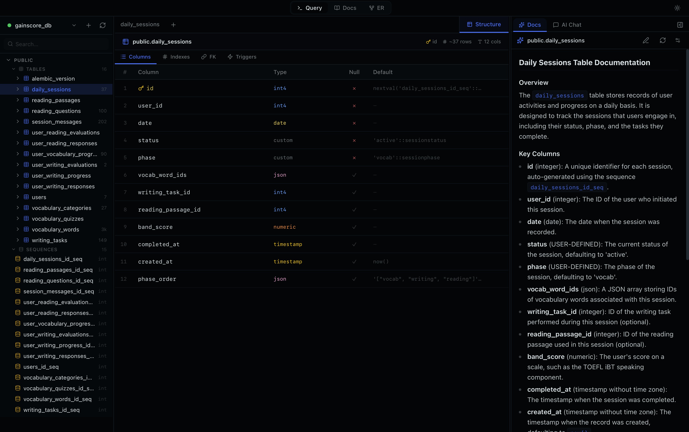
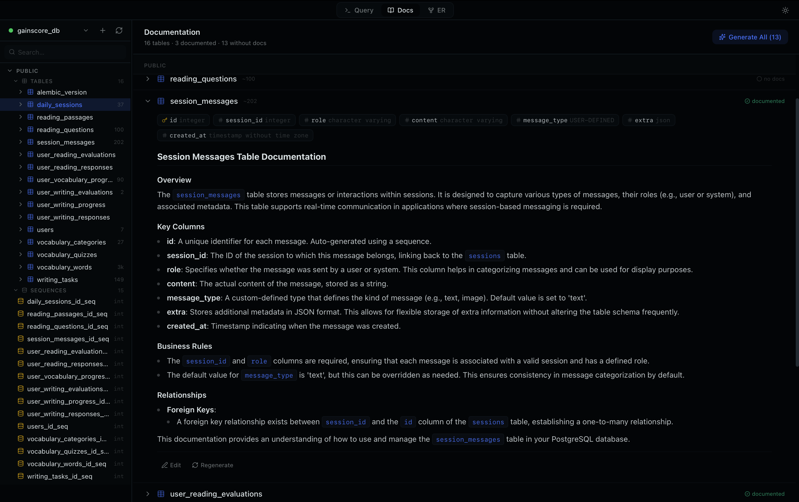
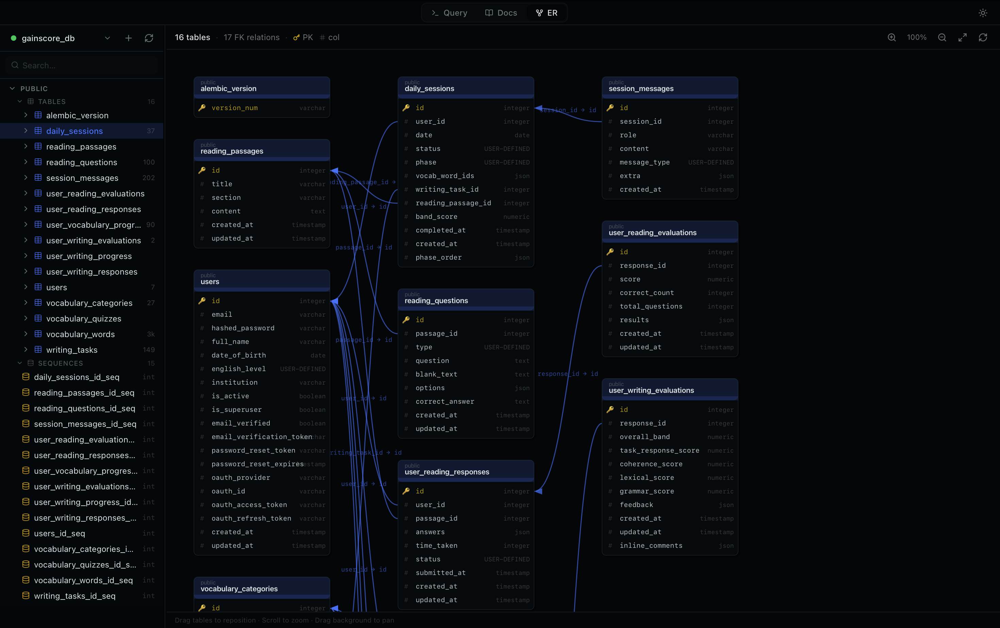

# LuneDB

A local-first database client with a built-in knowledge base.

LuneDB connects to your PostgreSQL databases, lets you browse and query them,
and keeps a Notion-style wiki about your schema right next to the data. An
optional local AI (via [Ollama](https://ollama.com)) can draft documentation and
answer questions about your schema.

Everything runs on your machine. There is no LuneDB account, no cloud sync, and
no telemetry.

[](https://github.com/alibekashirali/lunedb/releases/latest)
[](https://github.com/alibekashirali/lunedb/actions/workflows/ci.yml)
[](LICENSE)



<table>
  <tr>
    <td></td>
    <td></td>
  </tr>
  <tr>
    <td colspan="2"></td>
  </tr>
</table>

## Features

**Database**
- Connect to PostgreSQL, optionally through an SSH tunnel
- Browse schemas, tables, views, materialized views, functions and sequences
- SQL editor with syntax highlighting, formatting and query history
- Results grid, `EXPLAIN` panel and table structure view
- ER diagram of your schema
- Saved queries and a command palette

**Knowledge base**
- Markdown wiki pages stored locally, linked to your tables
- Generate table documentation from the schema with a local LLM
- Chat about your schema — the model gets your table list as context

**Privacy**
- Database passwords, SSH passwords and key passphrases live in the OS keychain
  (Keychain on macOS, Credential Manager on Windows, Secret Service on Linux),
  never in a config file. Private key files are never copied — LuneDB stores
  only the path and reads the key at connection time
- SSH host keys are checked against `~/.ssh/known_hosts` on a trust-on-first-use
  basis, like `ssh -o StrictHostKeyChecking=accept-new`: a new host is recorded,
  a changed key is refused
- Wiki pages, query history and connection settings are stored in a local
  SQLite file
- AI requests go to `localhost:11434` — your schema never leaves the machine

More detail, including the known limitations, is in [SECURITY.md](SECURITY.md).

## Tech stack

| Layer    | What                                                  |
| -------- | ----------------------------------------------------- |
| Shell    | Tauri v2 (Rust)                                       |
| Frontend | Next.js 15 (static export), React 19, TypeScript      |
| UI       | Tailwind CSS v4, shadcn/ui, CodeMirror 6              |
| State    | Zustand                                               |
| Backend  | Rust — `sqlx` (PostgreSQL), `ssh2`, `keyring`         |
| Storage  | SQLite via `tauri-plugin-sql`                         |

## Install

<!-- The direct link below points at a specific file and has to be updated on
     every release. The "all releases" link never goes stale. -->

**[Download for macOS (Apple Silicon)](https://github.com/alibekashirali/lunedb/releases/download/v0.1.0/LuneDB_0.1.0_aarch64.dmg)** — 8.6 MB, macOS 11 or newer

Other platforms and older versions are on the
[releases page](https://github.com/alibekashirali/lunedb/releases). Intel Macs,
Windows and Linux are not built yet — build from source for now.

The builds are **not code-signed**. On macOS the app is blocked after download
and may be reported as *"damaged"* — it is not, that is what Gatekeeper says
about unsigned apps. Drag it to Applications and clear the quarantine flag once:

```bash
xattr -dr com.apple.quarantine /Applications/LuneDB.app
```

To build it yourself instead, read on.

## Getting started

### Prerequisites

- **Node.js** 20 or newer
- **Rust** (stable) — install via [rustup](https://rustup.rs)
- **Platform build tools** — see the
  [Tauri prerequisites guide](https://tauri.app/start/prerequisites/):
  - macOS: Xcode Command Line Tools
  - Windows: Microsoft C++ Build Tools + WebView2
  - Linux: `webkit2gtk`, `libssl-dev`, `build-essential` and friends
- **Ollama** (optional) — only needed for the AI features

### Run in development

```bash
git clone https://github.com/alibekashirali/lunedb.git
cd lunedb
npm install
npm run tauri:dev
```

That starts the Next.js dev server and opens the desktop app. The first Rust
build takes a few minutes; later ones are fast.

### Build a release binary

```bash
npm run tauri:build
```

The installer or app bundle lands in `src-tauri/target/release/bundle/`.

### Enable the AI features

Install Ollama and pull a model, for example:

```bash
ollama pull llama3.2
```

LuneDB talks to Ollama on its default port (`11434`) and lets you pick any model
you have pulled. If Ollama is not running, the rest of the app works normally —
only the documentation and chat panels are unavailable.

## Project structure

```
src/                    Next.js frontend
  components/db/        connection dialog, schema tree
  components/editor/    SQL editor, results grid, EXPLAIN
  components/wiki/      markdown wiki and AI chat
  lib/                  Tauri command wrappers, Ollama client, SQLite helpers,
                        pure logic such as SQL statement splitting
  store/                Zustand store
src-tauri/              Rust backend
  src/db/               PostgreSQL connection, queries, schema introspection
  src/keychain.rs       OS keychain access
  src/ollama.rs         streaming LLM calls
  src/ssh_tunnel.rs     SSH port forwarding and host key verification
tests/                  Vitest unit tests for src/lib
docs/screenshots/       images used by this README
```

## Contributing

Issues and pull requests are welcome — see [CONTRIBUTING.md](CONTRIBUTING.md)
for the setup and the conventions, and [CODE_OF_CONDUCT.md](CODE_OF_CONDUCT.md)
for how we treat each other.

Before opening a PR, run what CI runs:

```bash
npm run lint
npm test
npm run build
cargo clippy --manifest-path src-tauri/Cargo.toml --all-targets -- -D warnings
cargo test --manifest-path src-tauri/Cargo.toml
```

Found a security problem? Please report it privately — [SECURITY.md](SECURITY.md).

## License

MIT — see [LICENSE](LICENSE).
